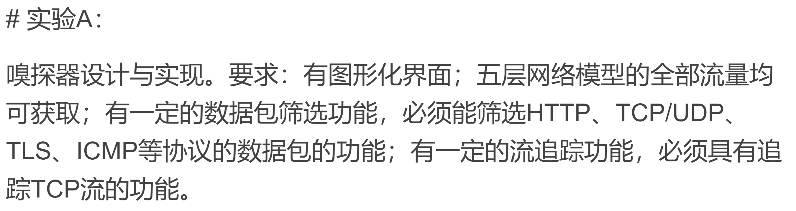
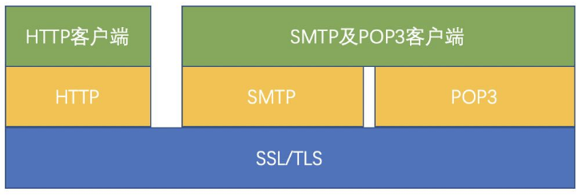
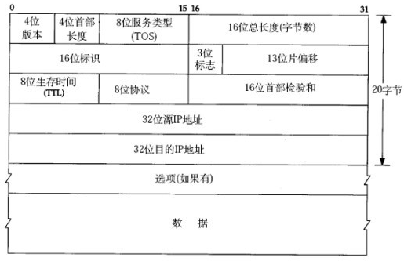

# it is net-sniffer


### 要求




#### 协议

ICMP TCP/UDP TLS HTTP


### 协议


HTTPS: 443




#### IP报头



#### TCP报头


注意：TCP中的报文信息是端口16位，IP信息在IP报头中32位的源、目的。


### socket

```python
# socket_proto = socket.IPPROTO_IP 0  或者 socket.IPPROTO_ICMP 1       
sniffer = socket.socket(socket.AF_INET, socket.SOCK_RAW, socket_proto)
port = 0
sniffer.bind((host, port))

# include the IP headers in the captured packets
sniffer.setsockopt(socket.IPPROTO_IP, socket.IP_HDRINCL, 1)

if win == 1:
	sniffer.ioctl(socket.SIO_RCVALL, socket.RCVALL_ON)

# read in a single packet
print("Listening ...")
print(sniffer.recvfrom(65565))
print("Done.")
```

#### 创建


前三项为family，后面的三个为type。	

注意这里使用了SOCK_RAW，而不是SOCK_STREAM或者SOCK_DGRAM。前者允许你操作header和data部分，后面俩只能访问到data部分。


### netifaces

```python
routingGateway = netifaces.gateways()["default"][netifaces.AF_INET][0]
routingNicName = netifaces.gateways()["default"][netifaces.AF_INET][1]
routingNicMacAddr = netifaces.ifaddresses(interface)[netifaces.AF_LINK][0]["addr"]
routingIPAddr = netifaces.ifaddresses(interface)[netifaces.AF_INET][0]["addr"]
routingIPNetmask = netifaces.ifaddresses(interface)[netifaces.AF_INET][0]["netmask"]
```


### ctypes

构建ip数据报头的解析


### struct


### TIPS

#### Linux下网卡混杂模式设置方法

```markdown
开启： ifconfig wlp60s0 promisc
关闭： ifconfig wlp60s0 -promisc
```


