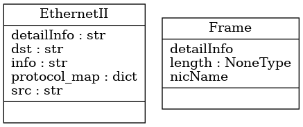
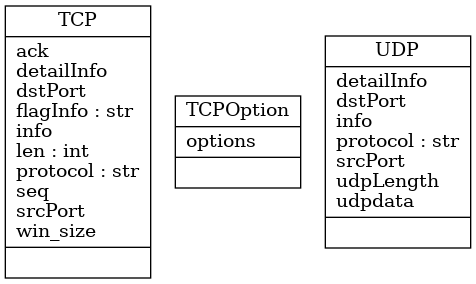

# **EX01- A： net sniffer**

姓名：黄树琦

学号：202028013229056

语言：python3.8

相关库：pyqt5 neticfaces socket ctypes struct

github：https://github.com/hsqforfun/net-sniffer.git


# 1.实验简介

## 1.1 实验背景

随着计算机网络技术的飞速发展 , 借助网络嗅探器进行网络流量监控和网络问题分析已成为网络管理员不可缺少的工作内容 。网络嗅探器是利用计算机的网络接口截获在网络中传输的数据信息的一种工具 , 主要用于分析网络的流量 , 以便找出所关心的网络中潜在的问题。网络嗅探器原本是提供给网络管理者监视网络运行状态和数据流动情况的有效管理工具 , 可以是软件 , 也可以是硬件 。硬件的网络嗅探器也称为协议分析器 , 是一种监视网络数据运行的设备 , 协议分析器既能用于合法网络管理也能用于窃取网络信息 , 但协议分析器价格非常昂贵 。狭义的网络嗅探器是指软件嗅探器 , 由于简单实用 ,目前对于软件网络嗅探器的研究日益成为热点 。将网络接口卡 NIC ( Network Interface Card ) 设置为混杂模式 , 嗅探器程序就有了捕获经过网络传输报文的能力 。

嗅探器的分析结果可以获知网络流量使用情况、网络资源使用率以及网络安全规则的执行情况等，作为网络评估、网络故障诊断和网络优化所使用，这样就可以知道网络的实际使用情况，找出网络存在的漏洞和影响网络性能的某些因素。比如ARP攻击，在一个广播式网络中ARP攻击很可能造成整个网段的瘫痪，要及时知道这些情况，我们可以通过网络嗅探器抓包分析来获取。再者网络的安全策略的执行情况，是否有受到攻击，来自哪里的攻击，网络嗅探器可以在对网络安全管理的过程中，实现对网络数据进行测量和监视，通过利用软件或者硬件嗅探器捕获数据包对数据内容进行分析处理。

## 1.2 实验要求

嗅探器设计与实现。要求：有图形化界面；四层网络模型的全部流量均可获取；有一定的数据包筛选功能，必须能筛选HTTP、TCP/UDP、TLS、ICMP等协议的数据包的功能；有一定的流追踪功能，必须具有追踪TCP流的功能。


# 2.设计细节

## 2.1 设计思想概要

​	本次实验设计中，在抓包方面选择了python的socket库来协助实现。python的socket库是基于C++的socket库实现的，使用方式大致相同。socket库对于抓包类型方面可以让用户直接抓取高层级的报文，如TCP、UDP。但为了本次实验，对于多层级的要求，选择使用原始套接字SOCK_RAW的类型，从而获取完整的包信息。

​	参考TCP/IP的四层协议，其中物理层由路由器、网卡等硬件实现，不在本次实验的代码实现范畴内。利用SOCK_RAW抓到的数据，是在数据链路层的数据帧构成。对于抓取到的数据帧信息，通过手写包含了IP报头、TCP报头、UDP报头等报头的类，来手动解析。根据抓包获得的数据，与py写的报头类进行匹配、判断，来实现报文的解析。

​	在GUI方面，选择python的PyQt5库来协助实现。PyQt5是python下的Qt5库，能够结合PyDesigner等图形化界面进行操作，能够通过拖拽的方式基本构建出UI框架。Designer工具操作一个.ui的文件，并且能够编译为一个.py文件。部分UI模块的具体参数，以及一些槽函数等不能直接在PyDesigner中实现，因此我们需要进一步丰富ui文件编译生成的py文件，来得到最终的图形界面。

​	对于TCP流追踪，目前的支持需要在嗅探的TCP流含有完整的三次握手，且报文不间断，否则不能确定Seq的相对值。四次挥手的部分可以没有。目前TCP流追踪的设计思想是，根据用户点击的TCP报文，来在报文列表中遍历有相同地址和端口的报文，通过TCP报头的标志位、seq、ack以及payload大小，来输出TCP流的相对Seq、相对Ack值。


## 2.2 原始套接字

​	网络嗅探器作为一种网络通讯程序 , 是通过对网卡的编程实现网络通讯的 , 对网卡的编程使用通常的套接字 ( socket) 方式进行 。但通常的套接字程序只能响应与自己硬件地址相匹配的 , 或是以广播形式发出的数据帧 , 对于其他形式的数据帧 , 如已到达网络接口但却不是发给此地址的数据帧 , 网络接口在验证投递地址并非自身地址后将不引起响应 , 即应用程序无法收取到达的数据包 。而网络嗅探器的目的恰恰在于从网卡接收所有经过它的数据包 。显然 , 要达到此目的就不能再让网卡按通常的模式工作 , 而必须将其设置为混杂模式。
​	这种对网卡混杂模式的设置是通过原始套接字 ( raw socket) 实现的 , 这也有别于通常使用的数据流套接字和数据报套接字 。在创建了原始套接字后 , 需要通过 setsockopt ( ) 函数设置 IP 头操作选项 , 然后再通过 bind ( ) 函数将原始套接字绑定到本地网卡上 。至此 , 就可以开始对网络数据包进行嗅探了 , 对数据包的获取仍像流式套接字或数据报套接字那样通过 recv ( ) 函数完成 。与其他两种套接字不同的是 , 原始套接字此时捕获到的数据包并不仅仅是单纯的数据信息 , 而是包含有 IP 头 、 TCP 头等信息头的最原始的数据信息 , 这些信息保留了它在网络传输时的原貌 。通过对这些在低层传输的原始信息的分析可以得到有关网络的一些信息 。

​	本次实验中，通过监听所有端口的原始套接字信息，接收包含数据报头的全部信息。核心的原始套接字部分代码如下：

``` python
sniffer = socket(socket.AF_PACKET, socket.SOCK_RAW, socket.htons(ETH_P_ALL))
sniffer.bind((nic, port))
sniffer.setsockopt(SOL_PACKET, PACKET_ADD_MEMBERSHIP, self.packet_mreq)
self.data, self.address = sniffer.recvfrom(65565)
```

​	为了在其他文件中更方便得进行调用，将嗅探器写为MySniffer的类，并提供sniffing和closeMe等函数，来使得外部类将其实例化后更方便得操作。


## 2.3 协议解析


​	在本次实验中，为便于报文解析，在protocol目录下共构建了frame_class、ethernet_class、ip_class、ipv6_class、icmpv6_class、arp_class、tcp_class、udp_class、http_class、tls_class十个用于构建报头或进行报头解析的类，并最终统一至packet_class的Packet类中实现。


​	当数据报文接收后，通过将data、address传参给Packet进行实例化。随后，frame、ethernet、ip等，按照TCP/IP四层协议有低至高进行报头匹配并实例化，最终还原出一个正确的被解析的报文。Packet类中的部分代码结构如下：

```python
self.frame = Frame(self.length, self.addres)
self.ethernetHead = EthernetII(self.data[:14])
        if self.ethernetHead.protocol == "IP":
            self.ipHead = IP(self.data[14:34])
            self.updateMe(self.ipHead)
            if self.ipHead.protocol == "TCP":
                self.tcpHead = TCP(self.data[34:54])
                    if (...):
                        self.httpHead = Http(self.data[54 + self.tcpOptionLen :])
                    elif (...) :
                        self.tlsHead = TLS(self.data[54 + self.tcpOptionLen :])
```

### 2.3.1 数据链路层

​	该层中，使用frame类来构建数据帧，ethernet类来构建数据报文中起始mac地址和协议的报头信息，类图如下所示：



​	注意一点，python是解释型的动态语言，对于变量的定义十分了灵活，因此不能很好做到提前分配固定的数据大小给变量预留空间。因此包含EthernetII等后续类的构建，借助使用ctype库来实现精准的数据结构定义，部分代码如下：

```python
    _fields_ = [ # 14 bytes
        ("dst_mac", c_ubyte * 6),
        ("src_mac", c_ubyte * 6),
        ("protocol_num", c_ushort), 
    ]
```

​	通过这种方式实现对报头长度的严格定义。

### 2.3.2 网络层

​	在网络层，构建了IP、IPv6、ICMPv6、ARP的四个报头，如下UML图所示：


​	在网络层，由于IP协议众多，使用了protocol_map的字典来对协议号进行解释，但本次实验只是实现了部分协议的报头，因此对于其他协议报头信息只能获取到，并不能很好得进行解析。

​	同时，在每个类下可能都有src、dst、detailInfo等元素，这是为了方便后续的输出信息到UI界面标准化，而使得变量名统一。

​	以最重要的IP报头为例，协议信息如下所示：


​	构建的IP类信息如下：

```python
_fields_ = [
    ("version", c_ubyte, 4),  # In IPv4 is set to 0100, which indicates 4 in binary
    ("headerLength", c_ubyte, 4),  # how many 32-bit words are present in the header
    ("tos", c_ubyte),
    ("totalLength", c_ushort),  # The total length is measured in bytes
    ("id", c_ushort),
    ("flags", c_ubyte, 3),
    ("offset", c_ushort, 13),
    ("ttl", c_ubyte),  # 8bit
    ("protocol_num", c_ubyte),
    ("checksum", c_ushort),  # 16bit
    ("srcIP", c_uint),  # 32bit
    ("dstIP", c_uint),  # 32bit
]
```


### 2.3.3 传输层

​	传输层的协议主要是TCP和UDP协议，内部包含了对于数据传输更详细的信息，如端口、数据长度、校验和等。以TCP协议为例，报头如下所示：


​	ctypes构建python的TCP报头：

```python
    _pack_ = 2
    _fields_ = [
        ("src_port", c_ushort),
        ("dst_port", c_ushort),
        ("seq", c_uint),
        ("ack", c_uint),
        ("lenres", c_ubyte),
        ("flags", c_ubyte),
        ("win_size", c_ushort),
        ("checksum", c_ubyte),
        ("urg_point", c_ubyte),
    ]
```

​	其中，由于不同机器的大小端可能不同，对于网络传输的数据，python的socket库提供了ntohs（network to host short）或ntohl（network to host long）的函数，方便了数据的转化。当然，对于mac地址或ipv6这样的没有内置函数的情况，通过手动写一些小的代码段实现数据转换。

​	TCP报头中，有8位的flags位，需要额外注意。当进行TCP追踪流识别时，需要对其识别并操作。

​	传输层协议的UML图如下：




​	

### 2.3.4 应用层	

​	在应用层的级别，传输的报文已经不止含有报头信息，还含有数据。如HTTP为例，将传输的GET、POST等操作都以ASCII码的形式进行传输。在解析时需要对报文信息进行判断，根据HTTP或TLS来进行后续的解析操作。


## 2.4 GUI

​	GUI选择借助PyQt5进行开发。在布局方面，分为了最上层的Button区，嗅探到的包Packet List区，包详细信息的Packet Detail区，以及最下方的二进制Packet Binary区以及相应ASCII码的ASCIItext区。

​	最上方的按键区提供的功能如下：

- 选择启用嗅探的网卡
- 单步嗅探
- 连续嗅探
- 停止嗅探
- 清空
- 嗅探TCP包
- 嗅探HTTP包
- 嗅探TLS包
- 连续嗅探TCP包

​    在设计时，由于目前支持的协议有限，并没有做到很完整的交互系统。用户只能通过点击目前提供的各种Button来进行操作。GUI的界面与wireshark类似，如下图所示：


​	所有嗅探到的包放置在Packet List区域。下方的Packet Detail区、Packet Binary区和ASCII区都是展示最近的一个包的信息。当想要查看之前包的信息时，单击Packet List区域中，报文的No按键，即可触发编写的函数，达到在下方的区域显示该信息的效果。

# 3.程序运行

## 3.1 运行前提

本实验中在linux的python3环境下运行，用到了socket、netifaces、pyqt5和ctypes库，可能需要通过pip install的方式进行安装。安装完成后，执行src目录下的runMe.py。由于需要将网卡设置为混杂模式，以及后续socket的调用，因此需要以sudo的方式运行。

## 3.2 运行结果

